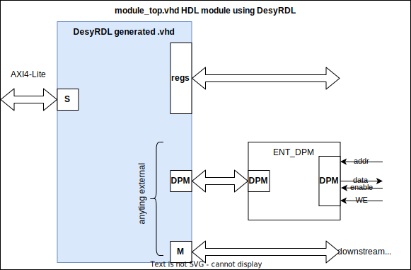
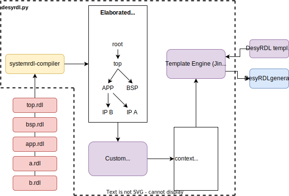

# DesyRDL

This tool generates outputs for an address space that is defined by one or many
SystemRDL&trade; 2.0 input files. The address space could be made up of all the
software-accessible registers and memory regions in an FPGA design, or just the
registers of a single IP block.

SystemRDL&trade; 2.0 is a standard released by Accellera Systems Initiative Inc
that is meant to describe such an address space, see [\[systemrdl\]](#systemrdl).

Outputs are based on templates. there is an option to use custom templates or the one provided by the tool.
The templates provided with this package are the common files for the following outputs:

* Synthesizable VHDL register logic
* Mapfiles (compatible with ChimeraTK)
* C header files
* AsciiDoc documentation

DesyRDL was developed at [DESY](https://desy.de) in the MSK firmware group as a
replacement for its existing proprietary method of register and address map
generation, the "Internal Interface", called "IBUS" in its latest version
[ii](#ii).

The use of SystemRDL&trade; 2.0 standard was considered for a long time,
but due to the lack of open source compilers or parsers, it was dropped.

The decision to use the SystemRDL&trade; 2.0 standard came after
the open source [SystemRDL compiler](https://github.com/SystemRDL/systemrdl-compiler) has been published.
This has been proposed by [MicroTCA Tech Lab](https://techlab.desy.de/) at DESY when they wrote
[HECTARE](https://github.com/MicroTCA-Tech-Lab/hectare), the predecessor of DesyRDL.

## Usage

This tool can be used standalone but was intended to be used as part of a
firmware build environment like DESY MSK's
[FPGA Firmware Framework](https://fpgafw.pages.desy.de/docs-pub/fwk/index.html),
short `fwk`.

See `desyrdl -h` for options.
All RDL files must be passed in the correct order. Below is an example for the
`desyrdl_example` modules which also comes with a testbench (not in Git yet):

    desyrdl -o out -i test/rdl/module_b.rdl test/rdl/module_a.rdl test/rdl/top.rdl -f vhdl adoc tcl

This will compile the `.rdl` file and create one `.vhd` in `./out/` for each
`addrmap` instance in the model and for each VHDL template in
`./desyrdl/templates/vhdl/`. The common files from `./desyrdl/libraries/vhdl/`
will also be copied there.

The generated VHDL logic should be integrated into your module or IP as an
entity next to the other logic. This is shown in the diagram below. Registers
and external interfaces are available on combined ports of a custom record type
(e.g. `t_addrmap_mymodule_in` and `t_addrmap_mymodule_out`). Through these
records, each node in this `addrmap` can be accessed by its SystemRDL instance
name. Check the generated VHDL package for details.

## Concept

Compiling the SystemRDL&trade; files is handled by
[SystemRDL Compiler](https://systemrdl-compiler.readthedocs.io/en/latest/).
To create useful information (or "context") for the template processing, its
Walker/Listener method of traversing the compiled tree is used.

`DesyListener` extends its `systemrdl.RDLListener` class. It extracts a fixed
set of information from the compiled tree and passes it on to a template engine
(Jinja2).

### Templates

Templates are written for the Jinja2 template engine. Users can provide their
own templates using `-t` switch.

### Context

Context creation differs a bit depending on the type of output. Some outputs
have to be generated for each `addrmap` component (e.g. VHDL) and others are
generated for the whole address space at once (e.g. mapfiles and the C header).

The context is a Python `dict` that contains further dictionaries to describe
register types and instances, memory types and instances, further external
components and some more. It is currently a bit of a mess.

## Supported interfaces buses

The DesyRDL allows to generate various top address map interfaces.
They are defined in the addrmap component by the `desyrdl_interface` variable.

Tool bus support and `desyrdl_interfaces` values:

| Value    | Description                                       | Bus Size | Supported |
|:---------|:--------------------------------------------------|:---------|:----------|
| AXI4L    | AXI4 Lite interface                               | 32 bit   | YES       |
| IBUS     | Internal Interface type bus, proprietary MSK DESY | 32 bit   | YES       |
| WISHBONE | Open source hardware computer bus                 | 32 bit   | planned   |

## Known Issues and Limitations

The bus decoder implementation is relatively basic:

* Only 32bit data busses
* Likewise, only 32 bit registers are supported
* The dual-port memory interface does not support AXI4 write strobes
* The logic operates on a single clock and the developer has to take care of any
  CDCs

## Acknowledgements

This tool relies heavily on systemrdl-compiler by Alex Mykyta and was only
developed because it exists.

Accellera&trade; and SystemRDL&trade; are trademarks of Accellera Systems
Initiative Inc.

## References

### systemrdl

"SystemRDL 2.0 Register Description Language", Accellera
Systems Initiative Inc, 2018,
available from https://accellera.org/downloads/standards/systemrdl

### ii

"INTERNAL INTERFACE, I/O Communication with FPGA Circuits and Hardware
Description Standard for Applications in HEP and FEL Electronics ver. 1.0",
2005, available from
https://flash.desy.de/reports_publications/tesla_reports/tesla_reports_2005/
