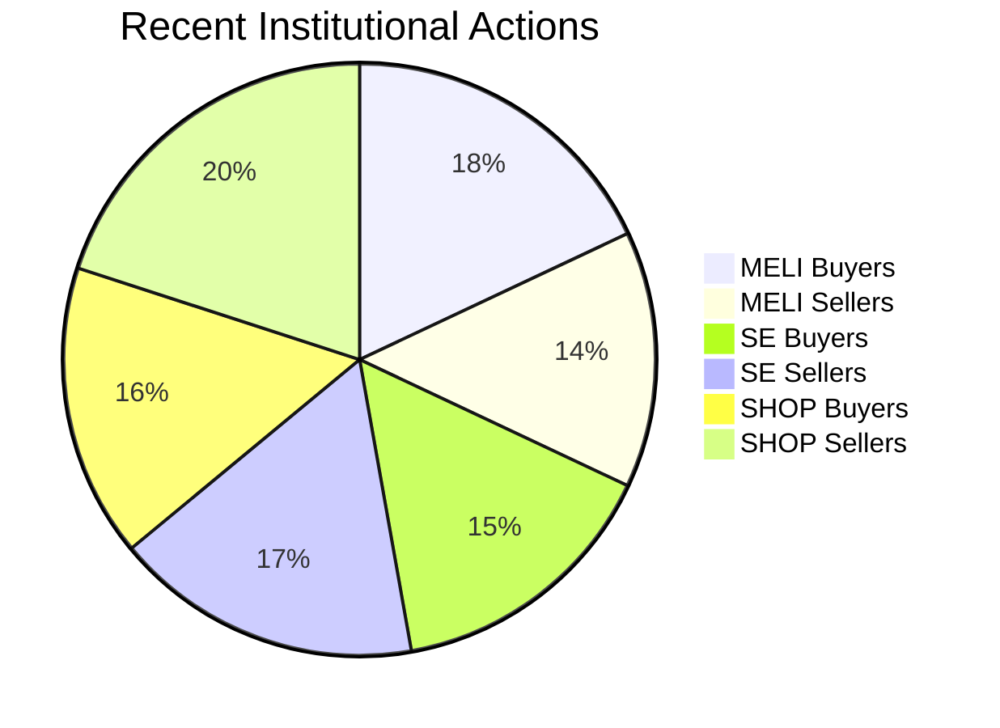
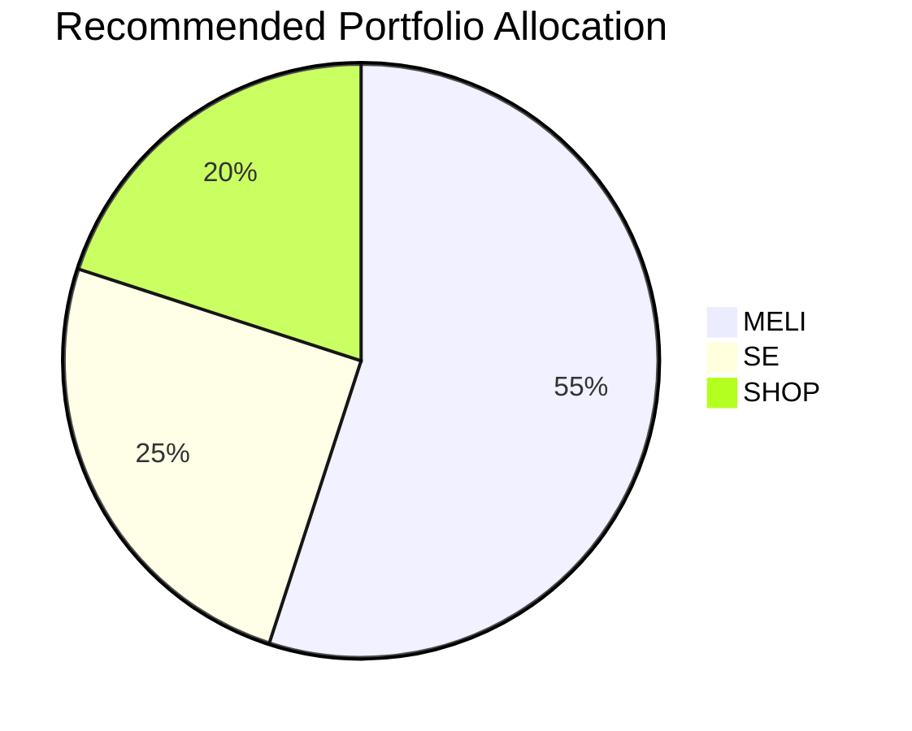

# Comparative Analysis Report: MELI vs SE vs SHOP (2025-05-04)

## 1. Fundamental Analysis

```mermaid
barChart
    title Fundamental Metrics Comparison
    x-axis Metric
    y-axis Value
    series "MELI" "SE" "SHOP"
    Revenue Growth: 51.5 5.9 19.6
    Profit Margin: 9.2 2.6 22.7
    P/E Ratio: 60.6 191.6 64.0
```

Key Observations:
- MELI shows highest revenue growth (51.5% ROE) but moderate profit margin (9.2%)
- SHOP has strongest profitability (22.7% margin) but faces tariff risks
- SE has weakest fundamentals (5.9% ROE) with excessive valuation (191.6 P/E)

## 2. Technical Analysis

```mermaid
lineChart
    title 1-Year Price Performance
    x-axis Months
    y-axis Price
    series "MELI" "SE" "SHOP"
    Jan-2025: 1800 100 85
    May-2025: 2280 141 99
```

Key Observations:
- SE had strongest rally (+112.7%) but with high volatility (43.4%)
- MELI showed steady growth (+39.9%) with better risk-adjusted returns
- SHOP struggled with -47.5% max drawdown despite 33.3% annual gain

## 3. Institutional Activity



Key Observations:
- MELI saw net institutional accumulation (+10)
- SE had slight institutional selling (-4)
- SHOP experienced significant institutional outflow (-10)

## 4. Market Sentiment

- CNN Fear & Greed Index: 42 (Fear)
- MELI: Most positive analyst sentiment (85% Buy ratings)
- SE: Mixed reviews despite price surge
- SHOP: Growing concerns about tariff impacts

## 5. Investment Recommendation



### Key Rationale:
1. MELI (55%):
   - Strongest fundamental growth story
   - Technical breakout confirmation
   - Least affected by tariffs

2. SE (25%):
   - High-risk/high-reward proposition
   - Requires close monitoring of profitability
   - Technical overbought signals emerging

3. SHOP (20%):
   - Valuation more attractive after pullback
   - Needs confirmation of trend reversal
   - Highest sensitivity to macro conditions

## 6. Risk Management Parameters

| Stock | Stop-loss | Take-profit | Key Levels to Watch |
|-------|-----------|-------------|----------------------|
| MELI  | $2150     | $2500       | $2400 resistance     |
| SE    | $130      | $160        | $145 support         |
| SHOP  | $95       | $120        | $105 resistance      |

Report generated at: 2025-05-04 18:46 SGT