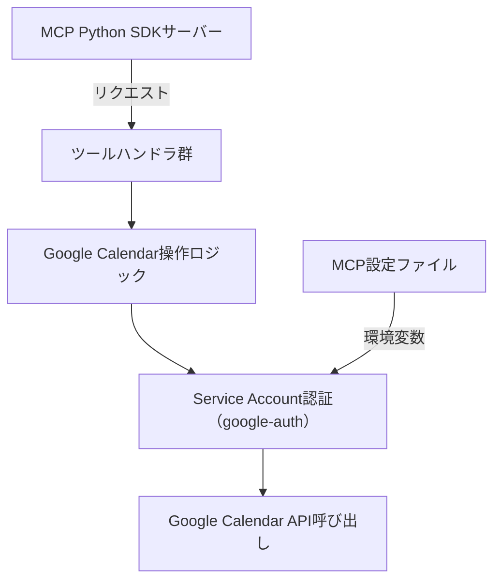

# Google Calendar MCP Python 実装 設計方針

## 技術構成

- MCP サーバー: [modelcontextprotocol/python-sdk](https://github.com/modelcontextprotocol/python-sdk)
- Google Calendar API: google-api-python-client, google-auth
- 認証: Service Account（環境変数で JSON パス指定）
- ランタイム・依存管理: uv, pyproject.toml, requirements.txt, uv.lock

## ディレクトリ構成案（src layout）

```
google-calendar-mcp/
├── src/
│   ├── main.py
│   └── tools/
│       └── calendar_tools.py
├── requirements.txt
├── pyproject.toml
├── uv.lock
└── docs/
    └── python-mcp-design.md
```

## 認証・設定

- MCP 設定ファイルまたは環境変数で `GOOGLE_APPLICATION_CREDENTIALS` に Service Account の JSON パスを指定
- サーバー起動時に google-auth で認証

## MCP ツール一覧（TypeScript 実装と同等）

- list-calendars
- list-events
- search-events
- create-event
- update-event
- delete-event
- list-colors

## 実装ステップ

1. MCP Python SDK サーバー雛形作成（tool 登録、main 関数）
2. Service Account 認証の初期化
3. 各ツールの Python 実装
4. MCP プロトコル仕様に準拠したレスポンス設計
5. テスト・動作確認

## 依存管理

- requirements.txt, pyproject.toml, uv.lock で uv による管理を行う

## Mermaid 構成図


