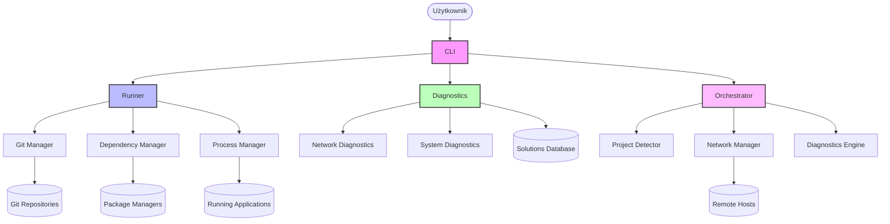
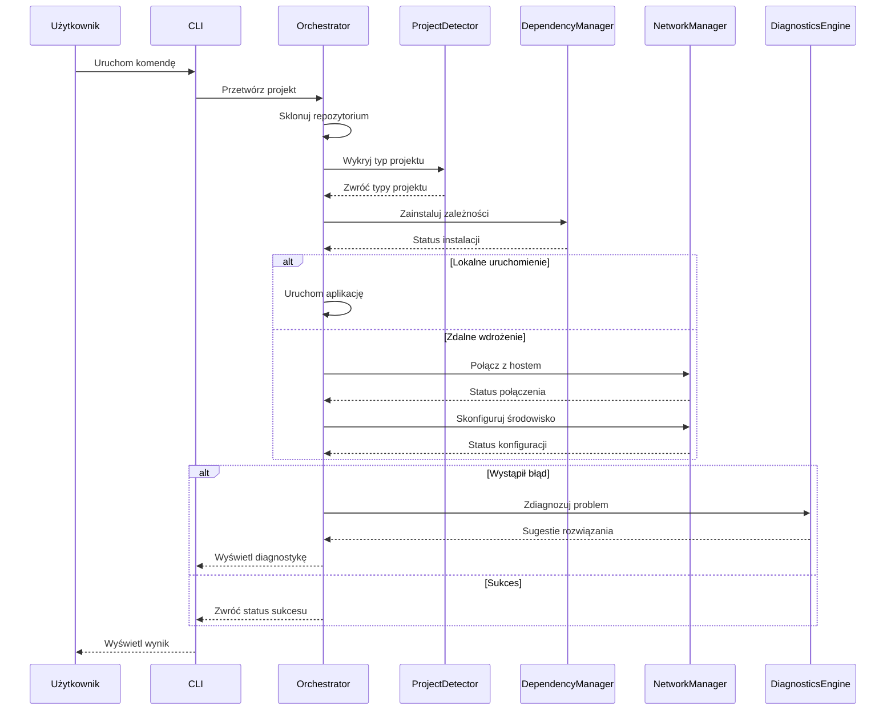
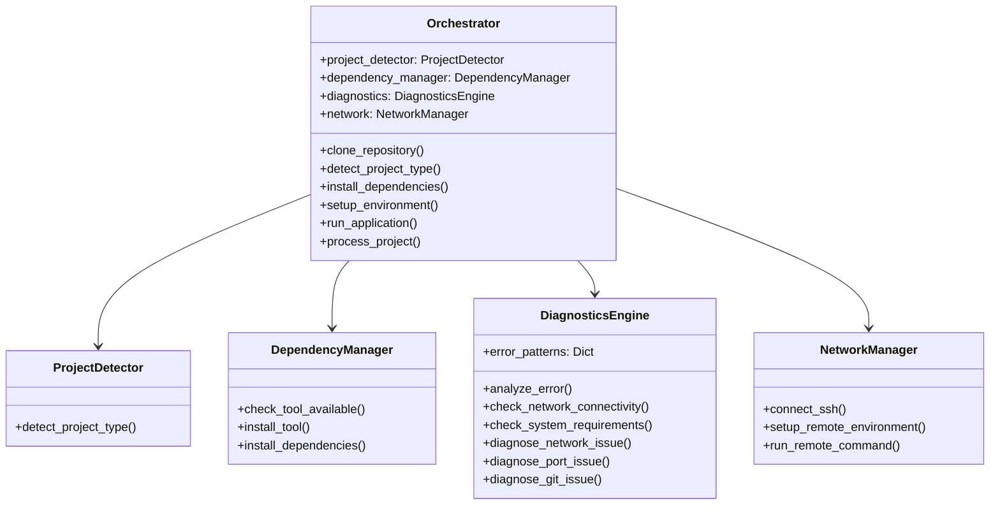
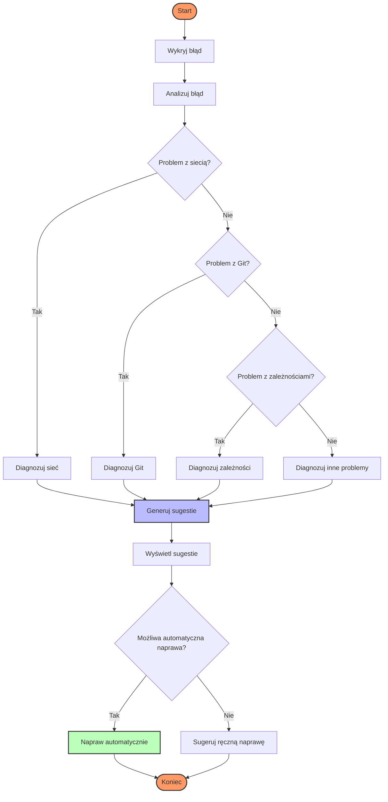
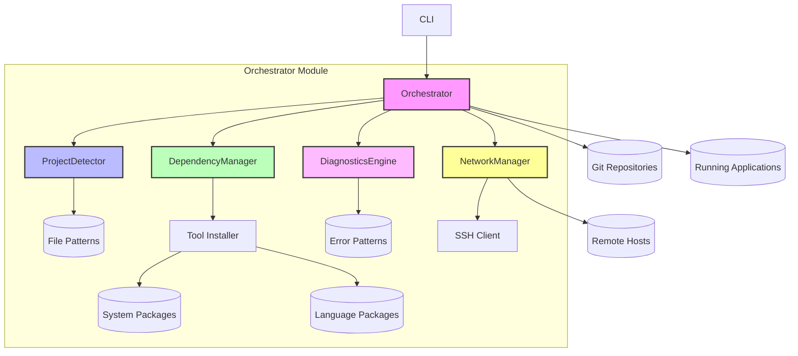

# Infrash

Inteligentny runner do rozwiązywania problemów infrastrukturalnych, zarządzania repozytoriami i automatyzacji wdrożeń.

## Opis

Infrash to narzędzie wiersza poleceń zaprojektowane do automatyzacji i rozwiązywania problemów związanych z infrastrukturą IT. Umożliwia zarządzanie repozytoriami, instalację zależności, diagnostykę i naprawę problemów oraz wdrażanie aplikacji na różnych systemach operacyjnych.

## Architektura systemu

### Ogólna architektura



### Przepływ danych w systemie



### Struktura modułów UnitMCP



### Przepływ diagnostyki



## Główne funkcje

- **Zarządzanie repozytoriami**: klonowanie, aktualizacja, synchronizacja
- **Zarządzanie zależnościami**: automatyczne wykrywanie i instalacja wymaganych pakietów
- **Diagnostyka i naprawa**: inteligentne wykrywanie i rozwiązywanie problemów
- **Automatyzacja wdrożeń**: instalacja, uruchamianie, monitorowanie aplikacji
- **Integracja z CI/CD**: obsługa GitLab CI i GitHub Actions
- **Baza danych rozwiązań**: aktualizowana baza wiedzy dotycząca popularnych problemów
- **Zdalne wdrażanie**: instalacja i konfiguracja aplikacji na zdalnych maszynach (np. Raspberry Pi)
- **Wieloplatformowe wsparcie**: uruchamianie aplikacji w różnych środowiskach (Python, Node.js, PHP, Shell, HTML)

## Instalacja

### Instalacja z PyPI

```bash
pip install infrash
```

### Instalacja z repozytorium

```bash
git clone https://github.com/UnitApi/infrash.git
cd infrash
pip install -e .
```

### Uruchomienie bez instalacji

Repozytorium zawiera skrypt `run.sh`, który automatycznie instaluje pakiet w trybie deweloperskim i uruchamia aplikację:

```bash
./run.sh [komenda] [argumenty]
```

Skrypt ten sprawdzi, czy pakiet `infrash` jest zainstalowany, a jeśli nie, zainstaluje go automatycznie przed uruchomieniem.

## Szybki start

```bash
# Inicjalizacja projektu
infrash init
# lub
./run.sh init

# Klonowanie repozytorium
infrash repo clone https://github.com/username/project.git
# lub
./run.sh repo clone https://github.com/username/project.git

# Instalacja zależności
infrash install
# lub
./run.sh install

# Uruchomienie aplikacji
infrash start
# lub
./run.sh start

# Sprawdzenie statusu
infrash status
# lub
./run.sh status

# Zdiagnozowanie problemów
infrash diagnose
# lub
./run.sh diagnose
```

## Zaawansowane użycie

### Uruchomienie z pełną diagnostyką

```bash
infrash start --diagnostic-level=full
# lub
./run.sh start --diagnostic-level=full
```

### Automatyczna naprawa problemu

```bash
infrash repair --auto
# lub
./run.sh repair --auto
```

### Aktualizacja bazy danych rozwiązań

```bash
infrash solutions update
# lub
./run.sh solutions update
```

### Zdalne wdrażanie na Raspberry Pi

```bash
infrash remote deploy --host 192.168.188.154 --user pi --repo https://github.com/UnitApi/mcp.git
# lub
./run.sh remote deploy --host 192.168.188.154 --user pi --repo https://github.com/UnitApi/mcp.git
```

### Uruchomienie aplikacji z repozytorium Git

```bash
infrash runner --repo https://github.com/username/project.git --type python
# lub
./run.sh runner --repo https://github.com/username/project.git --type python
```

## Orchestrator

Infrash zawiera moduł orchestratora, który umożliwia zarządzanie wieloma wdrożeniami jednocześnie. Orchestrator pozwala na:

- Równoległe wdrażanie na wielu maszynach
- Koordynację aktualizacji między różnymi systemami
- Automatyczne wykrywanie i naprawę problemów
- Monitorowanie stanu wszystkich wdrożeń

Przykłady użycia orchestratora można znaleźć w katalogu `examples/orchestrator/`.

### Architektura Orchestratora



## Zależności

Infrash wymaga następujących pakietów:
- Python 3.8+
- Git
- click>=8.0.0
- GitPython>=3.1.0
- requests>=2.25.0
- rich>=10.0.0
- pyyaml>=6.0
- psutil>=5.9.0
- packaging>=21.0
- Paramiko (dla zdalnych wdrożeń)

Wszystkie zależności zostaną automatycznie zainstalowane podczas instalacji pakietu.

## Rozwiązywanie problemów

### Brak modułu unitmcp

Jeśli napotkasz błąd `No module named 'unitmcp'`, oznacza to, że próbujesz uruchomić funkcje, które wymagają pakietu `unitmcp`. Ten pakiet jest opcjonalny i używany tylko do integracji z projektem UnitMCP. Możesz:

1. Zainstalować pakiet unitmcp, jeśli potrzebujesz tej funkcjonalności:
   ```bash
   pip install unitmcp
   ```

2. Używać tylko funkcji infrash, które nie wymagają unitmcp.

## Licencja


## Autor


[<span style='font-size:20px;'>&#x270D;</span>](git@github.com:UnitApi/python/edit/main/docs/footer.md)
<script type="module">    
  import mermaid from 'https://cdn.jsdelivr.net/npm/mermaid@10/dist/mermaid.esm.min.mjs';
  //import mermaid from 'https://cdn.jsdelivr.net/npm/mermaid@10.8.0/dist/mermaid.min.js';
  mermaid.initialize({
    startOnReady:true,
    theme: 'forest',
    flowchart:{
            useMaxWidth:false,
            htmlLabels:true
        }
  });
  mermaid.init(undefined, '.language-mermaid');
</script>
