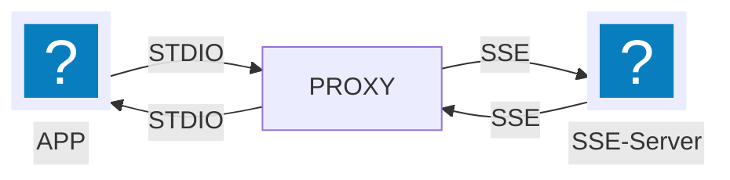

# MCP SSE Proxy

## Description

This script acts as a proxy between an MCP (Model Context Protocol) server using STDIO (standard input/output) transport and a client using SSE (Server-Sent Events) transport. It bridges the communication gap by converting MCP STDIO communication to the SSE protocol, enabling real-time data streaming over web connections.

**Communication Diagram:**

```
[App](STDIO) ----<>---- (STDIO)[PROXY](SSE) ----<>---- (SSE)[SSE-Server]
```




## Usage

To run the MCP SSE Proxy, execute the `mcp_sse_proxy.py` script with the required `--sse-url` or `ST_PROXY_SSE_URL` environment variable, which specifies the URL of your SSE server endpoint. This is the only required mandatory parameter.


### Installation

```bash
pip3 install mcp-sse-proxy
python3 -m mcp_sse_proxy -h
```

The package installer (pip) creates an executable script in the bin directory of your virtual environment (or Python installation). If you are in a virtual environment, you can run the script using directly as a command.
```bash
mcp-sse-proxy -h
```
### Before you start
If you do installation by copy-past, remember to install dependencies:
```bash
pip3 install -r requirements.txt
```

## Configuration

### Command-line Arguments

*   `--sse-url <url>`:  **(Required)**  The URL of the external SSE endpoint to connect to. You can also set this using the `ST_PROXY_SSE_URL` environment variable.
*   `--debug-enabled`:  Enable debug logging.  You can also set this using the `ST_PROXY_DEBUG_ENABLED` environment variable (set to `true` to enable).
*   `--ping-interval <seconds>`:  Set the interval (in seconds) for sending ping messages to maintain the SSE connection. Default is 10 seconds.  You can also set this using the `ST_PROXY_PING_INTERVAL` environment variable.

### Environment Variables

The proxy can be configured using the following environment variables:

*   `ST_PROXY_SSE_URL`: URL of the external SSE endpoint.
*   `ST_PROXY_DEBUG_ENABLED`: Enable debug logging (set to `true` to enable).
*   `ST_PROXY_DEBUG_FILENAME`:  Filename for the debug log file. Defaults to `mcp_sse_proxy.log`.
*   `ST_PROXY_PING_INTERVAL`: Ping interval in seconds.
*   `ST_PROXY_ENV_PREFIXES`:  Comma-separated list of environment variable prefixes to forward to the proxied application. This allows you to pass specific environment variables through the proxy. For example: `ANTHROPIC_,OPENAI_,GEMINI_`.


### Claude AI configuration example
Windows Config location: C:\Users\<USERNAME>\AppData\Roaming\Claude\claude_desktop_config
[or open via clinent menu: File->Settings then Developer->Edit Config]
Config example for Windows:


```json
{
  "globalShortcut": "",
  "mcpServers": {
    "mcp-sse-proxy": {
      "command": "C:\\Users\\<USERNAME>\\AppData\\Local\\Programs\\Python\\Python312\\python.exe",
      "args": [
        "C:\\mcp-sse-proxy-claude\\src\\mcp_sse_proxy.py",
		"--base-url", "http://<IP_ADDRESS>:8000",
		"--debug-enabled"
      ],
	  "env": {
		  "OPENAI_API_KEY": "sk-xxx",
		  "BRAVE_API_KEY": "BSAxxxx",
		  "ST_PROXY_ENV_PREFIXES": "OPENAI_,BRAVE_"
	  }
    }
  }
}
```

## Debug Logging

Debug logging can be enabled using the `--debug-enabled` command-line argument or by setting the `ST_PROXY_DEBUG_ENABLED` environment variable to `true`. When enabled, detailed logs are written to the file specified by the `ST_PROXY_DEBUG_FILENAME` environment variable (default: `mcp_sse_proxy.log`).

## Ping Interval

To ensure the SSE connection remains active, the proxy sends ping messages to the SSE server at regular intervals. The default interval is 10 seconds, configurable via the `--ping-interval` argument or the `ST_PROXY_PING_INTERVAL` environment variable.

## Before you start debuging
- Note that by design MCP SSE Proxy will not print any messages after running in CLI mode. As by design, [MCP will not log anything to STDIO, as this will interfere with protocol operation.](https://modelcontextprotocol.io/docs/tools/debugging#implementing-logging)
- Log file is stored in `mcp_sse_proxy.log` by default in same folder where `mcp_sse_proxy.py` script is located.
- Provides detailed information about SSE connections, tool calls, and system events (in debug file, you will see both side of connection messages - MCP and SSE)


⚠️ **Warning**: Enabling debug logging may expose sensitive information in logs. ⚠️


## License

This project is likely licensed under the MIT License. See the [LICENSE](LICENSE) file for details.