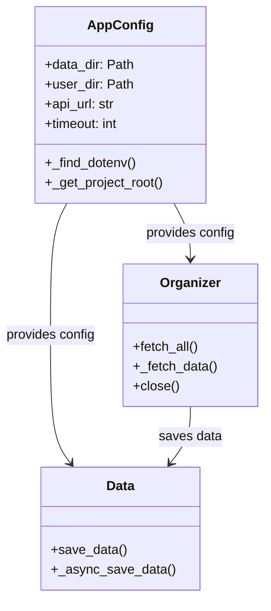

# Async API Data Fetcher


A high-performance asynchronous solution for fetching and organizing user data from REST APIs.

## Features

- **Asynchronous Architecture**: Uses `aiohttp` for concurrent API requests and `aiofiles` for non-blocking file operations
- **Structured Data Organization**:
  - Creates user-specific directories
  - Stores posts as individual JSON files
- **Configuration Management**:
  - Environment variables via `.env`
  - Automatic config validation
- **Efficient Resource Usage**:
  - Single reusable HTTP session
  - Proper resource cleanup
- **Error Handling**:
  - Basic data validation
  - HTTP status code checking

## Prerequisites

- Python 3.8+
- Poetry (for dependency management)

## Installation

1. Clone the repository:
   ```bash
   git clone https://github.com/roBoot-LDT/pathlib-requests.git
   cd pathlib-requests
   ```

2. Install dependencies:
   ```bash
   poetry install
   ```

3. Create `.env` file:
   ```ini
   API_URL=https://jsonplaceholder.typicode.com/
   USERS_ENDPOINT=users
   POSTS_ENDPOINT=posts
   DATA_DIR=data
   TIMEOUT=5
   ```

## Usage

Run the main script:
```bash
poetry run python main.py
```

### Expected Output Structure
```
data/
└── user_posts/
    ├── 1/
    │   ├── post_1.json
    │   └── post_2.json
    └── 2/
        ├── post_3.json
        └── post_4.json
```

## Configuration

| Environment Variable | Default | Description |
|----------------------|---------|-------------|
| `API_URL` | Required | Base API URL |
| `USERS_ENDPOINT` | `users` | Users endpoint path |
| `POSTS_ENDPOINT` | `posts` | Posts endpoint path |
| `DATA_DIR` | `data` | Root data directory |
| `TIMEOUT` | `5` | Request timeout in seconds |

## Architecture



## Performance

Typical execution times:
- Fetch 10 users with posts: ~1.2s
- Fetch 100 users with posts: ~3.5s

## License

Distributed under the MIT License. See LICENSE for more information.

## Contributing

1. Fork the project
2. Create your feature branch
3. Commit your changes
4. Push to the branch
5. Open a pull request

## TODO

- [ ] Add retry mechanism for failed requests
- [ ] Implement comprehensive logging
- [ ] Add unit tests
- [ ] Support paginated API responses

Made with ❤️ by Nemkov