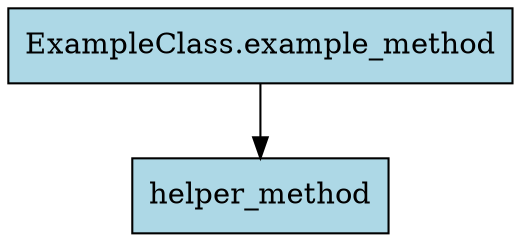

# Python Source AST Analyzer - DevLibX

A tool for analyzing Python source code using the Abstract Syntax Tree (AST) module to generate call graphs of methods.

## Features

- Parse Python source code files using Python's built-in AST module
- Identify and extract method definitions and method calls
- Build a directed graph representing the call relationships between methods
- Query the graph for:
  - All methods called by a specific method (outbound calls)
  - All methods that call a specific method (inbound calls)
- Support analysis of single files and entire directories/projects
- Handle Python-specific features like decorators, class methods, and nested functions
- Output in multiple formats (JSON, DOT/Graphviz, Text)
- Command-line interface for easy usage

## Installation

```bash
pip install python-source-ast-analyzer-devlibx
```

## Usage

### Command-line Interface

```bash
# Analyze a single file
ast-analyzer -f path/to/file.py --list-methods

# Analyze a directory recursively
ast-analyzer -d path/to/directory --recursive --list-methods

# Find route handlers (Flask or FastAPI)
ast-analyzer -d path/to/directory --recursive --find-routes

# Get outbound calls for a specific method
ast-analyzer -f path/to/file.py --method method_name --outbound --depth 2

# Get inbound calls for a specific method
ast-analyzer -f path/to/file.py --method method_name --inbound --depth 2

# Output in JSON format
ast-analyzer -f path/to/file.py --method method_name --outbound --format json

# Output to a file
ast-analyzer -f path/to/file.py --method method_name --outbound --output calls.json --format json

# Run as an HTTP server
ast-analyzer --server --host 0.0.0.0 --port 5000 --debug
```

### HTTP Server

The package can be run as an HTTP server, providing a REST API for analyzing Python source code:

```bash
# Start the server
ast-analyzer --server --port 5000
```

#### API Endpoints

1. **Health Check**
   ```
   GET /health
   ```

2. **Analyze Project**
   ```
   POST /v1/analyze_project
   ```
   Request body:
   ```json
   {
     "project_path": "/path/to/project",
     "recursive": true,
     "query_type": "outbound",
     "method_name": "example_method",
     "class_name": "ExampleClass",
     "file_path": "/path/to/file.py",
     "depth": 2,
     "flat": false
   }
   ```

3. **Find Route Handlers**
   ```
   POST /v1/find_routes
   ```
   Request body:
   ```json
   {
     "project_path": "/path/to/project",
     "recursive": true
   }
   ```

4. **List Methods**
   ```
   POST /v1/list_methods
   ```
   Request body:
   ```json
   {
     "project_path": "/path/to/project",
     "recursive": true
   }
   ```

### Python API

#### Using the Core API

```python
from python_source_ast_analyzer_devlibx.graph.graph_builder import GraphBuilder
from python_source_ast_analyzer_devlibx.query.query_engine import QueryEngine
from python_source_ast_analyzer_devlibx.output.formatters import JSONFormatter

# Build a call graph from a file
graph_builder = GraphBuilder()
call_graph = graph_builder.build_from_file("path/to/file.py")

# Create a query engine
query_engine = QueryEngine(call_graph)

# Find methods by name
methods = query_engine.find_methods_by_name("method_name")
if methods:
    method_id = methods[0].unique_id
    
    # Get outbound calls
    outbound_calls = query_engine.get_outbound_calls(method_id, depth=2)
    
    # Format as JSON
    formatter = JSONFormatter()
    json_output = formatter.format_outbound_calls(outbound_calls)
    print(json_output)
```

#### Using the HTTP Server API

```python
from python_source_ast_analyzer_devlibx.server.server import create_app, run_server

# Create a Flask app
app = create_app()

# Run the server
run_server(host="0.0.0.0", port=5000, debug=True)

# Or run the app with Flask's development server
# app.run(host="0.0.0.0", port=5000, debug=True)

# Or use the app with a WSGI server like Gunicorn
# import gunicorn
# gunicorn.app.wsgiapp.run()
```

#### Making HTTP Requests to the Server

```python
import requests
import json

# Health check
response = requests.get("http://localhost:5000/health")
print(response.json())  # {"status": "healthy"}

# Analyze a project
payload = {
    "project_path": "/path/to/project",
    "recursive": True,
    "method_name": "example_method",
    "query_type": "outbound",
    "depth": 2
}
response = requests.post("http://localhost:5000/v1/analyze_project", json=payload)
result = response.json()
print(json.dumps(result, indent=2))
```

## Output Formats

### JSON

```json
{
  "method": {
    "name": "example_method",
    "module": "example",
    "file_path": "example.py",
    "class_name": "ExampleClass",
    "line_number": 10,
    "is_async": false,
    "decorators": ["route"],
    "unique_id": "example.py#ExampleClass.example_method#10",
    "simple_id": "ExampleClass.example_method"
  },
  "calls": [
    {
      "method": {
        "name": "helper_method",
        "module": "example",
        "file_path": "example.py",
        "class_name": null,
        "line_number": 20,
        "is_async": false,
        "decorators": [],
        "unique_id": "example.py#helper_method#20",
        "simple_id": "helper_method"
      },
      "calls": []
    }
  ]
}
```

### DOT/Graphviz



### Text

```
ExampleClass.example_method (example.py:10)
  helper_method (example.py:20)
```

## Requirements

- Python 3.8 or higher
- NetworkX 2.6.0 or higher (for graph algorithms)

## License

MIT License
