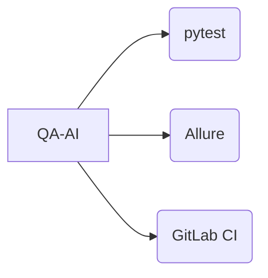
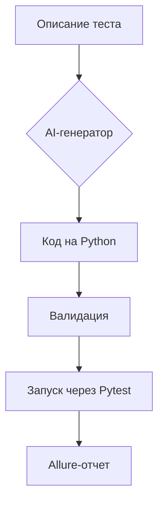

# QA-AI Framework 🚀

**Умный генератор автотестов с AI-ассистентом**  
*Ускорьте создание тестов в 3 раза с помощью искусственного интеллекта*

[](https://python.org)
[](https://pydantic.dev)
[](LICENSE)


[](https://t.me/qa_ai_ru)

# Умная валидация:
 - Проверка синтаксиса
 - Контроль наличия assert-проверок
 - Автоисправление простых ошибок

# Интеграция с популярными инструментами:

# Архитектура

## 🌟 Ключевые возможности

- **AI-генерация тестов** из описания на естественном языке
- **Поддержка всех видов тестирования**:
```python
# UI (Selene), API (Requests), Mobile (Appium)
generator.generate_test("Проверка логина", type="web")
```
## 🛠 Быстрый старт
*Установка*
bash
```bash
pip install qa_ai
```
**Пример использования**
```python

from qa_ai import OpenAITestGenerator

generator = OpenAITestGenerator(api_key="your_key")
test_code = generator.generate_test(
    description="Проверить корзину с 2 товарами",
    prompt_type="web/ecommerce"
)

exec(test_code)  # или сохраните в файл
```
# 📂 Структура проекта
```
.
├── ai/                  # AI-компоненты
├── autotests/           # Сгенерированные тесты
├── config/              # Настройки
└── docs/                # Примеры и руководства
```
# 🔧 Настройка
1. Создайте .env в корне проекта:

```ini
AI_OPENAI_API_KEY=your_key_here
AI_MODEL=gpt-4-turbo
```
2. Добавьте шаблоны в ai/prompts/:

```markdown
# web/login.md
Сгенерируй тест для: {description}
Требования:
- Используй PageObject
- Добавь 3 проверки
```
# 🤖 Поддерживаемые AI-провайдеры
| Провайдер |      Модели     |    Требования    |
|:---------:|:---------------:|:----------------:|
|   OpenAI  |    GPT-3.5/4    |     API-ключ     |
| Llama.cpp | Llama 3/Mistral |     8+ GB RAM    |
| Anthropic |      Claude     | Доступ по invite |
