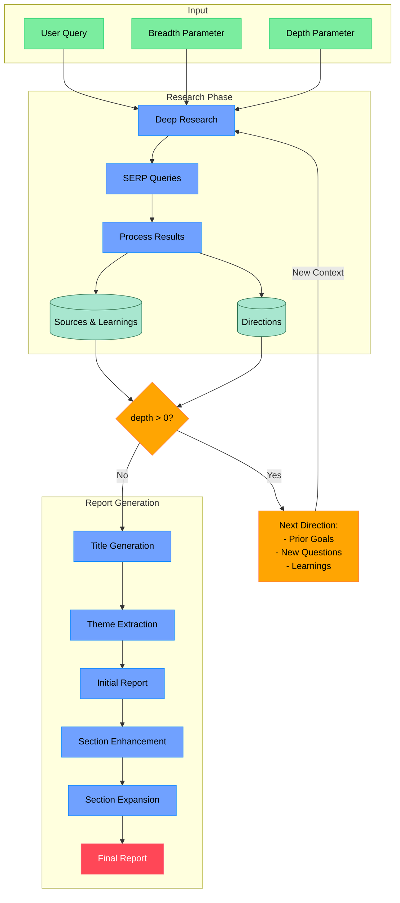

# Shandu 2.0: Advanced AI Research System with Robust Report Generation

Shandu is a cutting-edge AI research assistant that performs in-depth, multi-source research on any topic using advanced language models, intelligent web scraping, and iterative exploration to generate comprehensive, well-structured reports with proper citations.

[](LICENSE)
[](https://www.python.org/downloads/)

## 🔍 What is Shandu?

Shandu is an intelligent, LLM-powered research system that automates the comprehensive research process - from initial query clarification to in-depth content analysis and report generation. Built on LangGraph's state-based workflow, it recursively explores topics with sophisticated algorithms for source evaluation, content extraction, and knowledge synthesis.

### Key Use Cases

- **Academic Research**: Generate literature reviews, background information, and complex topic analyses
- **Market Intelligence**: Analyze industry trends, competitor strategies, and market opportunities
- **Content Creation**: Produce well-researched articles, blog posts, and reports with proper citations
- **Technology Exploration**: Track emerging technologies, innovations, and technical developments
- **Policy Analysis**: Research regulations, compliance requirements, and policy implications
- **Competitive Analysis**: Compare products, services, and company strategies across industries

## 🚀 What's New in Version 2.0

Shandu 2.0 introduces a major redesign of the report generation pipeline to produce more coherent, reliable reports:

- **Modular Report Generation**: Process reports in self-contained sections, enhancing overall system reliability
- **Robust Error Recovery**: Automatic retry mechanisms with intelligent fallbacks prevent the system from getting stuck
- **Section-By-Section Processing**: Each section is processed independently, allowing for better error isolation
- **Progress Tracking**: Detailed progress tracking helps identify exactly where the process is at each stage
- **Enhanced Citation Management**: More reliable citation handling ensures proper attribution throughout reports
- **Intelligent Parallelization**: Key processes run in parallel where possible for improved performance
- **Comprehensive Fallback Mechanisms**: If any step fails, the system gracefully degrades rather than halting

## ⚙️ How Shandu Works



## 🌟 Key Features

- **Intelligent State-based Workflow**: Leverages LangGraph for a structured, step-by-step research process
- **Iterative Deep Exploration**: Recursively explores topics with dynamic depth and breadth parameters
- **Multi-source Information Synthesis**: Analyzes data from search engines, web content, and knowledge bases
- **Enhanced Web Scraping**: Features dynamic JS rendering, content extraction, and ethical scraping practices
- **Smart Source Evaluation**: Automatically assesses source credibility, relevance, and information value
- **Content Analysis Pipeline**: Uses advanced NLP to extract key information, identify patterns, and synthesize findings
- **Sectional Report Generation**: Creates detailed reports by processing individual sections for maximum reliability
- **Parallel Processing Architecture**: Implements concurrent operations for efficient multi-query execution
- **Adaptive Search Strategy**: Dynamically adjusts search queries based on discovered information
- **Full Citation Management**: Properly attributes all sources with formatted citations in multiple styles

## 🏁 Quick Start

```bash
# Install from PyPI
pip install shandu

# Install from source
git clone https://github.com/jolovicdev/shandu.git
cd shandu
pip install -e .

# Configure API settings (supports various LLM providers)
shandu configure

# Run comprehensive research
shandu research "Your research query" --depth 2 --breadth 4 --output report.md

# Quick AI-powered search with web scraping
shandu aisearch "Who is the current sitting president of United States?" --detailed
```

## 📚 Detailed Usage

### Research Command

```bash
shandu research "Your research query" \
    --depth 3 \                # How deep to explore (1-5, default: 2)
    --breadth 5 \              # How many parallel queries (2-10, default: 4)
    --output report.md \       # Save to file instead of terminal
    --verbose                  # Show detailed progress
```

### Example Reports

You can find example reports in the examples directory:

1. **The Intersection of Quantum Computing, Synthetic Biology, and Climate Modeling**
   ```bash
   shandu research "The Intersection of Quantum Computing, Synthetic Biology, and Climate Modeling" --depth 3 --breadth 3 --output examples/o3-mini-high.md
   ```

## 💻 Python API

```python
from shandu.agents import ResearchGraph
from langchain_openai import ChatOpenAI

# Initialize with custom LLM if desired
llm = ChatOpenAI(model="gpt-4")

# Initialize the research graph
researcher = ResearchGraph(
    llm=llm,
    temperature=0.5
)

# Perform deep research
results = researcher.research_sync(
    query="Your research query",
    depth=3,       # How deep to go with recursive research
    breadth=4,     # How many parallel queries to explore
    detail_level="high"
)

# Print or save results
print(results.to_markdown())
```

## 🧩 Advanced Architecture

### Research Pipeline

Shandu's research pipeline consists of these key stages:

1. **Query Clarification**: Interactive questions to understand research needs
2. **Research Planning**: Strategic planning for comprehensive topic coverage
3. **Iterative Exploration**:
   - Smart query generation based on knowledge gaps
   - Multi-engine search with parallelized execution
   - Relevance filtering of search results
   - Intelligent web scraping with content extraction
   - Source credibility assessment
   - Information analysis and synthesis
   - Reflection on findings to identify gaps

### Report Generation Pipeline

Shandu 2.0 introduces a robust, modular report generation pipeline:

1. **Data Preparation**: Registration of all sources and their metadata for proper citation
2. **Title Generation**: Creating a concise, professional title (with retry mechanisms)
3. **Theme Extraction**: Identifying key themes to organize the report structure
4. **Citation Formatting**: Properly formatting all citations for reference
5. **Initial Report Generation**: Creating a comprehensive draft report
6. **Section Enhancement**: Individually processing each section to add detail and depth
7. **Key Section Expansion**: Identifying and expanding the most important sections
8. **Report Finalization**: Final processing and validation of the complete report

Each step includes:
- Comprehensive error handling
- Automatic retries with exponential backoff
- Intelligent fallbacks when issues occur
- Progress tracking for transparency
- Validation to ensure quality output

## 🔌 Supported Search Engines & Sources

- Google Search
- DuckDuckGo
- Wikipedia
- ArXiv (academic papers)
- Custom search engines can be added

## 📊 Technical Capabilities

- **Dynamic JS Rendering**: Handles JavaScript-heavy websites
- **Content Extraction**: Identifies and extracts main content from web pages
- **Parallel Processing**: Concurrent execution of searches and scraping
- **Caching**: Efficient caching of search results and scraped content
- **Rate Limiting**: Respectful access to web resources
- **Robots.txt Compliance**: Ethical web scraping practices
- **Flexible Output Formats**: Markdown, JSON, plain text

## 📜 License

This project is licensed under the MIT License - see the [LICENSE](LICENSE) file for details.
