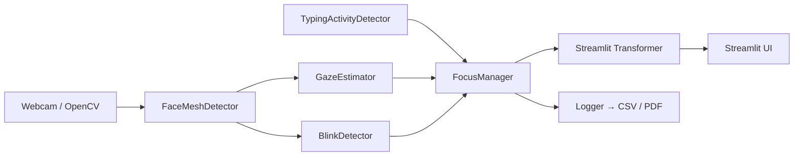

# 🎯 Smart Focus AI

[](https://github.com/GeeksterLab/SmartFocusAI/actions)
[](https://codecov.io/gh/GeeksterLab/SmartFocusAI)
[](https://pypi.org/project/smart-focus-ai)  
[](https://smartfocusai.streamlit.app)

---

## 📖 Table of Contents

1. [Introduction](#-introduction)  
2. [Architecture](#-architecture)  
3. [Project Structure](#-project-structure)  
4. [Libraries](#-libraries)  
5. [Installation](#-installation)  
6. [Usage](#-usage)  
6. [Deployment](#-deployment)  
7. [Tests & CI](#-tests--ci)  
8. [License](#-license)

---

## 🧐 Introduction

**Smart Focus AI** est une application Python qui utilise votre webcam pour détecter en temps réel si vous êtes **focalisé·e** ou **distrait·e**, en combinant :

- la direction du regard (gaze) via MediaPipe FaceMesh  
- la détection de frappe clavier (TypingActivityDetector)  
- le comptage de clignements d’yeux (BlinkDetector)  

À la fin de chaque session, elle génère un rapport **CSV** et un résumé **PDF** de vos périodes de focus, typing et distraction.

---

## 🚧 Architecture

Voici un diagramme Mermaid qui présente les composants principaux et leurs interactions :



- FaceMeshDetector extrait landmarks faciaux
- GazeEstimator et BlinkDetector traitent ces landmarks
- TypingActivityDetector écoute les frappes clavier
- FocusManager fusionne tous les signaux en un état Focused/Distracted
- Streamlit Transformer superpose l’overlay sur la vidéo
- Logger écrit les données et génère le rapport

## 📁 Projet Structure

- **.github**: GitHub Actions workflows (CI, deploy…).
- **logs**: logs CSV & PDF reports.
- **notebooks/**: Exploration & prototypage.
- **src/**: Source code (gaze, blink, typing, focus).
- **tests/**: unit & integration tests
- **requirements.txt**: Dependencies pip.
- **setup.py**: Packaging setuptools.
- **streamlit.py**: Streamlit interface.

---

## 📦 Libraries

* **mediapipe** → FaceMesh & iris tracking.
* **numpy** → For mathematical operations and numerical array processing.
* **matplotlib** → For creating classic visualizations (charts, scatter plots, etc.) for PDF reports.
* **scikit-learn** → Machine-learning models.
* **pandas** → Log management & data analysis.
* **jupyterlab** → For developping and testing your analysis interactively in notebooks.
* **imutils** → OpenCV utilitaires.
* **pytestd** → For unit tests.
* **pynput** → Keyboard activity detection.
* **fpdf** →  PDF report creation.
* **opencv-python** → Captur & video processing.
* **pytest** → Unit, integration testing & coverage.
* **streamlit / streamlit-webrtc** (optional) → Real-time web interface.
* **pyobjc-framework-AVFoundation** (optional) → popup for MacOS camera persmission.

---

## ⚙️ Installation

1. To clone the repo, run :
```bash
git clone https://github.com/GeeksterLab/SmartFocusAI.git
cd smart_focus_ai
```

2. Create and activate Python 3.10+ environment, run :
```bash
python3.10 -m venv env
source env/bin/activate
```

3. Install the idependencies :
```bash
   pip install -r requirements.txt
```

4. Install editable mode :
From the root project, instal the package in development mode by running :
```bash
pip install -e 
```

## 🚀 Usage
<!-- Run to complete the pipeline and generate the visualizations :  -->

1. Run the main script :
```bash
    python main.py
```

2. Web inteface (Streamlit) :
```bash
   streamlit run src/streamlit_app.py
```

---

## ☁️  Deployment

- You can try this project on Streamlit instead of installing it locally.

[](https://smartfocusai.streamlit.app)

⚠️ **WARNING :**

- **If you also want to try the typing function, you have to install this project locally because `pynput` only works on a local machine, not on a distant server.**
- **Thank you for your understanding. 🙏**

---

## 🧪  Tests & CI

Show report, execute : :
```bash
pytest --cov=smart_focus_ai --cov-report=term-missing --cov-report=xml
```

---


MIT © 2025 [GeeksterLab]
