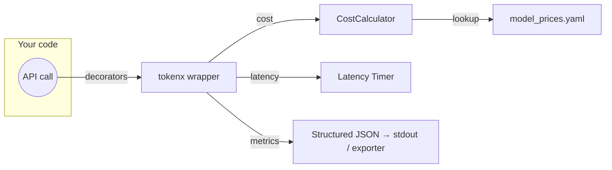

<p align="center">
  
</p>

<h1 align="center">🧮 tokenx-core</h1>
<p align="center"><em>Instant cost&nbsp;•&nbsp;Instant latency&nbsp;•&nbsp;Zero code refactor</em></p>

<p align="center"><strong>👉 Like what you see?&nbsp;<a href="https://github.com/dvlshah/tokenx/stargazers">Star the repo</a> &nbsp;and&nbsp;<a href="https://github.com/dvlshah">follow @dvlshah</a> for updates!</strong></p>


<p align="center">
  <a href="https://pypi.org/project/tokenx-core/"></a>
  <a href="https://github.com/dvlshah/tokenx/actions/workflows/test.yml"></a>
  <a href="https://pypi.org/project/tokenx-core/"></a>
  <a href="https://opensource.org/licenses/MIT"></a>
  <!-- <a href="https://codecov.io/gh/dvlshah/tokenx"></a> -->
  <a href="https://pypi.org/project/tokenx-core/"></a>
  <!-- <a href="https://github.com/dvlshah/tokenx/discussions"></a> -->
</p>
> Plug-and-play decorators for tracking **cost** & **latency** of LLM API calls.

tokenx provides a simple way to monitor the cost and performance of your LLM integrations without changing your existing code. Just add decorators to your API call functions and get detailed metrics automatically.


> **Decorator in → Metrics out.**
> Monitor cost & latency of any LLM function without touching its body.

```bash
pip install tokenx-core[openai]          # 1️⃣ install
```

```python
from tokenx.metrics import measure_cost, measure_latency   # 2️⃣ decorate
from openai import OpenAI

@measure_latency
@measure_cost(provider="openai", model="gpt-4o-mini")
def ask(prompt: str):
    return OpenAI().chat.completions.create(
        model="gpt-4o-mini",
        messages=[{"role": "user", "content": prompt}]
    )

resp, m = ask("Hello!")                                   # 3️⃣ run
print(m["cost_usd"], "USD |", m["latency_ms"], "ms")
```

---

## 🤔 Why tokenx?

Integrating with LLM APIs often involves hidden costs and variable performance. Manually tracking token usage and calculating costs across different models and providers is tedious and error-prone. `tokenx` simplifies this by:

*   **Effortless Integration:** Add monitoring with simple decorators, no need to refactor your API call logic.
*   **Accurate Cost Tracking:** Uses up-to-date, configurable pricing (including caching discounts) for precise cost analysis.
*   **Performance Insights:** Easily measure API call latency to identify bottlenecks.
*   **Multi-Provider Ready:** Designed to consistently monitor costs across different LLM vendors (OpenAI currently supported, more coming soon!).

---

## 🏗️ Architecture (1‑min overview)



*No vendor lock‑in:*  pure‑Python wrapper emits plain dicts—pipe them to Prometheus, Datadog, or stdout.

---

## 💡 Features at a glance

* **Track & save money** – live USD costing with cached‑token discounts
* **Trace latency** – pinpoint slow models or network hops
* **Plug‑&‑play decorators** – wrap any sync or async function
* **Provider plug‑ins** – OpenAI today, Anthropic & Gemini next
* **Typed** – 100 % `py.typed`, 95 %+ mypy coverage
* **Zero deps** – slims Docker images

---

## 📦 Installation

```bash
pip install tokenx-core                 # stable
pip install tokenx-core[openai]         # with provider extras
```

---

## 🚀 Quick Start

Here's how to monitor your OpenAI API calls with just two lines of code:

```python
from tokenx.metrics import measure_cost, measure_latency
from openai import OpenAI

@measure_latency
@measure_cost(provider="openai", model="gpt-4o-mini")  # Always specify provider and model
def call_openai():
    client = OpenAI()
    return client.chat.completions.create(
        model="gpt-4o-mini",
        messages=[{"role": "user", "content": "Hello, world!"}]
    )

response, metrics = call_openai()

# Access your metrics
print(f"Cost: ${metrics['cost_usd']:.6f}")
print(f"Latency: {metrics['latency_ms']:.2f}ms")
print(f"Tokens: {metrics['input_tokens']} in, {metrics['output_tokens']} out")
print(f"Cached tokens: {metrics['cached_tokens']}")  # New in v0.2.0
```

## 🔍 Detailed Usage

### Cost Tracking

The `measure_cost` decorator requires explicit provider and model specification:

```python
@measure_cost(provider="openai", model="gpt-4o")  # Explicit specification required
def my_function(): ...

@measure_cost(provider="openai", model="gpt-4o", tier="flex")  # Optional tier
def my_function(): ...
```

### Latency Measurement

The `measure_latency` decorator works with both sync and async functions:

```python
@measure_latency
def sync_function(): ...

@measure_latency
async def async_function(): ...
```

### Combining Decorators

Decorators can be combined in any order:

```python
@measure_latency
@measure_cost(provider="openai", model="gpt-4o")
def my_function(): ...

# Equivalent to:
@measure_cost(provider="openai", model="gpt-4o")
@measure_latency
def my_function(): ...
```

### Async Usage

Both decorators work seamlessly with `async` functions:

```python
import asyncio
from tokenx.metrics import measure_cost, measure_latency
from openai import AsyncOpenAI # Use Async client

@measure_latency
@measure_cost(provider="openai", model="gpt-4o-mini")
async def call_openai_async():
    client = AsyncOpenAI()
    response = await client.chat.completions.create(
        model="gpt-4o-mini",
        messages=[{"role": "user", "content": "Tell me an async joke!"}]
    )
    return response

async def main():
    response, metrics = await call_openai_async()
    print(metrics)

# asyncio.run(main()) # Example of how to run it
```

### Direct Cost Calculation

For advanced use cases, you can calculate costs directly:

```python
from tokenx.cost_calc import CostCalculator

# Create a calculator for a specific provider and model
calc = CostCalculator.for_provider("openai", "gpt-4o")

# Calculate cost from token counts
cost = calc.calculate_cost(
    input_tokens=100,
    output_tokens=50,
    cached_tokens=20
)

# Calculate cost from response object
cost = calc.cost_from_response(response)
```

---

## 🔄 Provider Compatibility

tokenx is designed to work with multiple LLM providers. Here's the current compatibility matrix:

| Provider | Status | SDK Version | Response Formats | Models |
|----------|--------|-------------|-----------------|--------|
| OpenAI | ✅ | >= 1.0.0 | Dict, Pydantic | All models (GPT-4, GPT-3.5, etc.) |
| Anthropic | 🔜 | - | - | Claude models (coming soon) |
| Google | 🔜 | - | - | Gemini models (coming soon) |

### OpenAI Support Details

- **SDK Versions**: Compatible with OpenAI Python SDK v1.0.0 and newer
- **Response Formats**:
  - Dictionary responses from older SDK versions
  - Pydantic model responses from newer SDK versions
  - Cached token extraction from `prompt_tokens_details.cached_tokens`
- **API Types**:
  - Chat Completions API
  - Traditional Completions API
  - Support for the newer Responses API coming soon

## 🛠️ Advanced Configuration

### Custom Pricing

Prices are loaded from the `model_prices.yaml` file. You can update this file when new models are released or prices change:

```yaml
openai:
  gpt-4o:
    sync:
      in: 2.50        # USD per million input tokens
      cached_in: 1.25 # USD per million cached tokens
      out: 10.00      # USD per million output tokens
```

### Error Handling

tokenx provides detailed error messages to help diagnose issues:

```python
from tokenx.errors import TokenExtractionError, PricingError

try:
    calculator = CostCalculator.for_provider("openai", "gpt-4o")
    cost = calculator.cost_from_response(response)
except TokenExtractionError as e:
    print(f"Token extraction failed: {e}")
except PricingError as e:
    print(f"Pricing error: {e}")
```

## 📊 Example Metrics Output

When you use the decorators, you'll get a structured metrics dictionary:

```python
{
    "provider": "openai",
    "model": "gpt-4o-mini",
    "tier": "sync",
    "input_tokens": 12,
    "output_tokens": 48,
    "cached_tokens": 20,        # New in v0.2.0
    "cost_usd": 0.000348,       # $0.000348 USD
    "latency_ms": 543.21        # 543.21 milliseconds
}
```

## 🤝 Contributing

```bash
git clone https://github.com/dvlshah/tokenx.git
pre-commit install
pip install -e .[dev]   # or `poetry install`
pytest -q && mypy src/
```

See [CONTRIBUTING.md](docs/CONTRIBUTING.md) for details.

---

## 📝 Changelog

See [CHANGELOG.md](docs/CHANGELOG.md) for full history.

---

## 📜 License

MIT © 2025 Deval Shah

<p align="center"><em>If tokenX saves you time or money, please consider <a href="https://github.com/sponsors/dvlshah">sponsoring</a> or giving a ⭐ – it really helps!</em></p>
