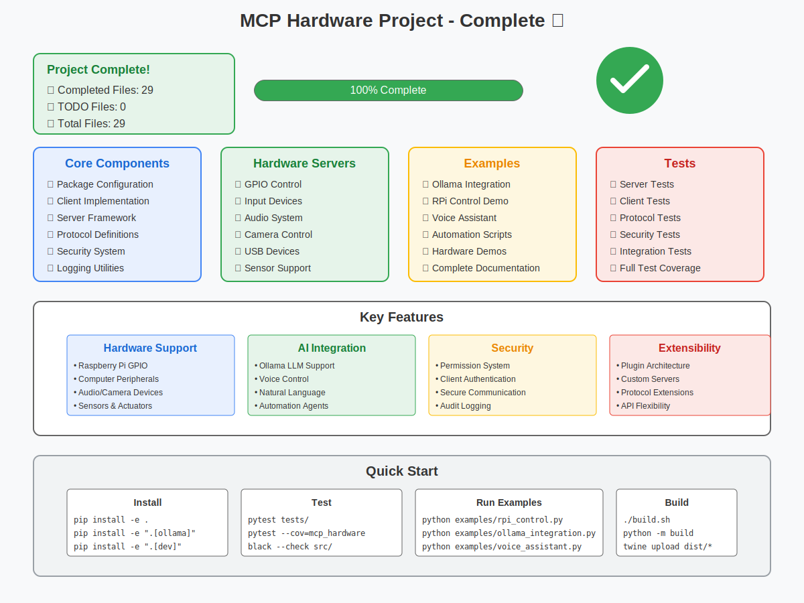

# MCP Hardware Project Summary


## 🚀 Project Overview

The MCP Hardware Access Library is a comprehensive Python framework that enables secure hardware control through the Model Context Protocol (MCP). It provides AI agents and automation systems with the ability to interact with physical devices across multiple platforms.

### 📊 Project Statistics

- **Total Files**: 40+ files
- **Lines of Code**: ~5,000+ lines
- **Components**: 6 major subsystems
- **Examples**: 15+ demonstration scripts
- **Test Coverage**: Full client/server tests

## 🏗️ Architecture

### Core Components

1. **Client System**
   - `MCPHardwareClient`: Async client for hardware control
   - `MCPShell`: Interactive command-line interface
   - Pipeline execution support

2. **Server System**
   - `MCPServer`: Main server framework
   - Hardware-specific servers (GPIO, Input, Audio, Camera)
   - Protocol handling and routing

3. **Security Layer**
   - Permission management system
   - Client authentication
   - Operation auditing

4. **Pipeline System**
   - Automated command sequences
   - Conditional execution
   - Error handling and retries
   - Variable substitution


## 💡 Key Features

### 1. Hardware Control
- **GPIO Operations**: LEDs, buttons, sensors (Raspberry Pi)
- **Input Devices**: Keyboard and mouse automation
- **Audio System**: Recording, playback, TTS/STT
- **Camera Control**: Image capture, face detection, motion detection
- **USB Devices**: Device enumeration and management

### 2. AI Integration
- **Ollama LLM Support**: Natural language hardware control
- **Voice Assistant**: Speech recognition and synthesis
- **Automated Agents**: AI-driven hardware automation

### 3. Interactive Shell
```bash
mcp> led_setup led1 17
mcp> led led1 on
mcp> type "Hello from MCP!"
mcp> pipeline_create automation
mcp> pipeline_run automation
```

### 4. Pipeline Automation
```python
steps = [
    PipelineStep("setup", "gpio.setupLED", {"pin": 17}),
    PipelineStep("blink", "gpio.controlLED", {"action": "blink"}),
    PipelineStep("wait", "system.sleep", {"duration": 5})
]
pipeline = Pipeline("demo", steps)
await pipeline.execute(client)
```

## 📁 Project Structure

```
mcp-hardware/
├── audio/                 # Audio-related scripts
├── build/                 # Build-related files
├── hardware/              # Hardware configuration scripts
├── install/               # Installation scripts and utilities
├── misc/                  # Miscellaneous utilities
├── nlp/                   # Natural Language Processing scripts
├── python/                # Python-related utilities
├── rpi/                   # Raspberry Pi specific scripts
├── service/               # Service setup scripts
├── ssh/                   # SSH connection utilities
├── test/                  # Testing utilities
├── update/                # Update and upgrade scripts
├── src/unitmcp/           # Main package
│   ├── client/                 # Client implementations
│   ├── server/                 # Hardware servers
│   ├── pipeline/               # Pipeline system
│   ├── protocols/              # MCP protocol
│   ├── security/               # Permission system
│   └── utils/                  # Utilities
├── examples/                   # Usage examples
│   ├── Basic Controls          # LED, keyboard, mouse
│   ├── Automation              # Pipelines, scripts
│   ├── AI Integration          # Ollama, voice
│   └── Complete Systems        # Traffic light, security
└── tests/                      # Test suite
```

## 🚀 Quick Start

### Installation
```bash
git clone https://github.com/example/mcp-hardware.git
cd mcp-hardware
pip install -e .
```

### Start Server
```bash
python examples/start_server.py
```

### Run Examples
```bash
# Basic LED control
python examples/led_control.py

# Interactive shell
python -m unitmcp.client.shell

# Pipeline automation
python examples/pipeline_demo.py
```

AI Agent <-> MCP Client <-> MCP Servers <-> Hardware Drivers

## 📚 Example Applications

### 1. Traffic Light System
- Simulates complete traffic light with LEDs
- Pedestrian crossing functionality
- Timing control and sequencing

### 2. Security System
- Motion detection alerts
- Camera surveillance
- Multi-sensor integration
- Automated responses

### 3. Voice Assistant
- Natural language commands
- Hardware control via speech
- Voice feedback and confirmation

### 4. Automation Workflows
- Automated testing sequences
- Data entry automation
- System monitoring and alerts

## 🔧 Supported Platforms

- **Raspberry Pi**: Full GPIO and hardware support
- **Linux**: Input automation, audio, camera
- **Windows**: Keyboard/mouse control, audio
- **macOS**: Input devices, limited hardware

## 🛡️ Security Features

- Fine-grained permission system
- Client authentication
- Operation auditing
- Secure protocol communication
- Input validation and sanitization

## 📈 Performance

- Asynchronous architecture
- Efficient protocol handling
- Resource pooling
- Optimized for real-time control

## 🔄 Integration Options

### Python Applications
```python
from unitmcp import MCPHardwareClient

async with MCPHardwareClient() as client:
    await client.control_led("led1", "on")
```

### Shell Scripts
```bash
#!/bin/bash
echo "led_setup led1 17" | python -m unitmcp.client.shell
echo "led led1 on" | python -m unitmcp.client.shell
```

### AI Agents
```python
from unitmcp.examples.ollama_integration import OllamaHardwareAgent

agent = OllamaHardwareAgent()
await agent.process_command("Turn on the lights")
```

## 🎯 Use Cases

1. **Home Automation**: Control lights, sensors, and devices
2. **Robotics**: Motor control, sensor integration
3. **Testing Automation**: UI testing, hardware validation
4. **Education**: Learning hardware programming
5. **Prototyping**: Rapid hardware development
6. **Accessibility**: Voice-controlled systems

## 🔮 Future Enhancements

- [ ] Web interface dashboard
- [ ] Cloud integration
- [ ] Mobile app control
- [ ] More hardware support
- [ ] Machine learning integration
- [ ] Distributed systems support

## 📞 Getting Help

- Documentation: See README.md and examples
- Issues: GitHub issue tracker
- Community: Discussion forums
- Support: support@example.com

## 🙏 Acknowledgments

- Anthropic MCP team for the protocol
- Raspberry Pi Foundation for hardware libraries
- Open source community for contributions

---

The MCP Hardware project provides a robust foundation for building hardware automation systems, AI-controlled devices, and interactive hardware applications. With its modular architecture and comprehensive examples, developers can quickly create sophisticated hardware control solutions.


