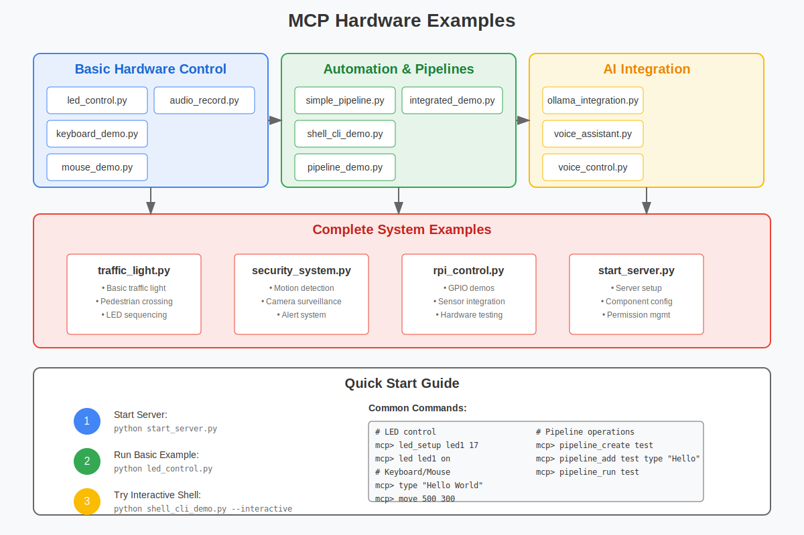
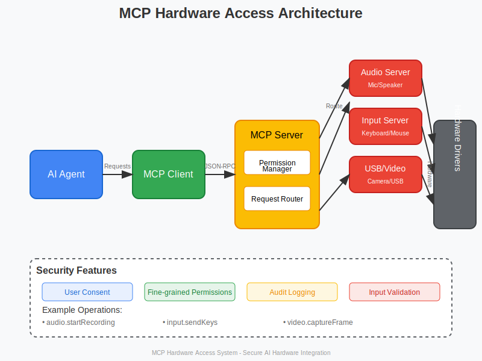
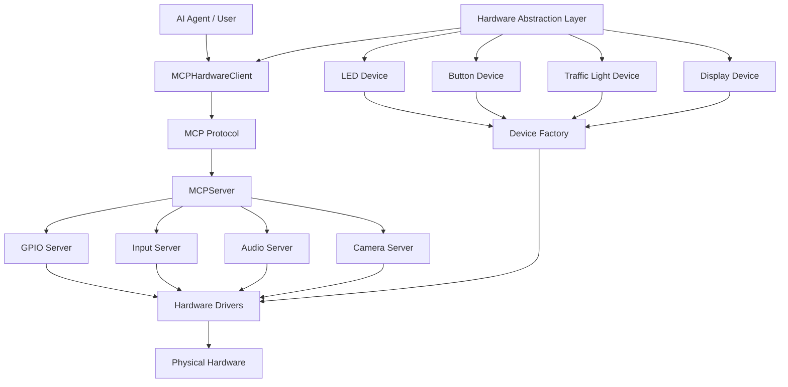

# MCP Hardware Project Summary



## 🚀 Project Overview

The MCP Hardware Access Library is a comprehensive Python framework that enables secure hardware control through the Model Context Protocol (MCP). It provides AI agents and automation systems with the ability to interact with physical devices across multiple platforms.

### 📊 Project Statistics

- **Total Files**: 40+ files
- **Lines of Code**: ~5,000+ lines
- **Components**: 7 major subsystems
- **Examples**: 15+ demonstration scripts
- **Test Coverage**: Full client/server tests

### 🆕 Latest Updates (May 2025)

- **Project Reorganization**: Improved directory structure for better organization and clarity
- **Unified Documentation**: Consolidated documentation in a structured format
- **Standardized Configuration**: Reorganized configuration files for consistency
- **Simulation Mode**: Enhanced simulation capabilities for development without hardware
- **DSL Integration**: Fixed and improved Domain-Specific Language support
- **Claude 3.7 Integration**: Added natural language processing for device control
- **Mock Device Factory**: Created mock implementations for testing
- **Comprehensive Testing**: All integration tests now passing
- **Claude UnitMCP Plugin**: New plugin for advanced natural language hardware control
- **Remote Device Control**: Enhanced shell CLI for interactive remote device control
- **GPIO Streaming**: Added real-time GPIO streaming from Raspberry Pi to client PC
- **SSH/TCP Support**: Added support for both SSH and TCP connections to remote devices

### 📁 New Project Structure

The project has been reorganized to improve clarity and reduce duplication:

- **Documentation**: All documentation is now in the `docs/` directory with clear sections
- **Configuration**: Configuration files are now in the `configs/` directory
- **Source Code**: Source code is organized into logical categories in `src/unitmcp/`
- **Examples**: Examples are categorized by functionality
- **Tests**: Test structure aligns with the source code structure

See the [Migration Guide](docs/MIGRATION_GUIDE.md) for details on the changes and how to update your code.

## 🏗️ Architecture

### Core Components

1. **Client System**
   - `MCPHardwareClient`: Async client for hardware control
   - `MCPShell`: Interactive command-line interface
   - Pipeline execution support

2. **Server System**
   - `MCPServer`: Main server framework
   - `DeviceManager`: Hardware device management
   - `SecurityManager`: Authentication and authorization

3. **Hardware Abstraction**
   - Platform-specific implementations
   - Simulation support for development
   - Device discovery and configuration

4. **Remote Control**
   - Shell-based remote control interface
   - WebSocket-based real-time updates
   - SSH and TCP connection options
   - GPIO streaming from Raspberry Pi to client PC

5. **Domain-Specific Language**
   - YAML-based device configuration
   - Natural language command processing
   - Pipeline definition language

6. **Security Layer**
   - Permission management system
   - Client authentication
   - Operation auditing

7. **Pipeline System**
   - Automated command sequences
   - Conditional execution
   - Error handling and retries
   - Variable substitution

8. **DSL System** 
   - Domain-Specific Language for hardware configuration
   - YAML-based device definitions
   - Natural language command processing via Claude 3.7
   - Command parsing and execution

9. **Claude UnitMCP Plugin**
   - Advanced natural language processing for hardware control
   - Multi-turn conversation support with context awareness
   - Robust error handling with conversational recovery
   - Integration with DSL system and MockDeviceFactory
   - Simulation mode for testing without hardware



## 📊 Architecture Diagrams

### System Architecture



For more detailed architecture documentation, see the [Architecture Documentation](docs/architecture/README.md).

### Project Structure

The project has been reorganized with the following structure:

```
UnitMCP/
├── configs/                # Configuration files
│   ├── env/                # Environment variables
│   └── yaml/               # YAML configuration files
│       ├── devices/        # Device configurations
│       ├── automation/     # Automation configurations
│       └── security/       # Security configurations
├── docs/                   # Documentation
│   ├── api/                # API documentation
│   ├── architecture/       # Architecture documentation
│   │   ├── diagrams/       # Architecture diagrams
│   │   └── descriptions/   # Component descriptions
│   ├── guides/             # User guides
│   │   ├── installation/   # Installation guides
│   │   ├── hardware/       # Hardware guides
│   │   └── llm/            # LLM integration guides
│   ├── examples/           # Example documentation
│   └── development/        # Development documentation
├── docker/                 # Docker configurations
├── examples/               # Example code
│   ├── basic/              # Basic examples
│   ├── platforms/          # Platform-specific examples
│   ├── llm/                # LLM integration examples
│   └── advanced/           # Advanced examples
├── src/                    # Source code
│   └── unitmcp/            # UnitMCP package
│       ├── core/           # Core functionality
│       ├── hardware/       # Hardware abstraction layer
│       ├── communication/  # Communication protocols
│       ├── dsl/            # Domain-specific language
│       ├── llm/            # LLM integration
│       ├── plugin/         # Plugin system
│       ├── security/       # Security features
│       ├── utils/          # Utility functions
│       └── simulation/     # Simulation components
└── tests/                  # Tests
    ├── unit/               # Unit tests
    ├── integration/        # Integration tests
    ├── system/             # System tests
    └── performance/        # Performance tests
```

## 🔌 Remote Device Control and GPIO Streaming

UnitMCP provides powerful capabilities for remote device control and real-time GPIO streaming:

### Interactive Shell Control

The `shell_cli` module provides an interactive shell interface for controlling remote devices:

```bash
# Start the interactive shell
cd examples/shell_cli
python shell_cli_demo.py --interactive

# In the shell
mcp> connect 192.168.1.100 8888
mcp> gpio_setup 17 OUT
mcp> led_setup led1 17
mcp> led led1 on
```

For simpler implementations, a lightweight shell is also available:

```bash
# Connect via TCP
python simple_remote_shell.py --host 192.168.1.100 --port 8888

# Connect via SSH (requires paramiko)
python simple_remote_shell.py --host 192.168.1.100 --port 22 --ssh
```

### Real-time GPIO Streaming

The `rpi_control` module enables real-time streaming of GPIO pin states from a Raspberry Pi to a client PC:

```bash
# On the Raspberry Pi
cd examples/rpi_control
python server.py --stream-gpio

# On the client PC
cd examples/rpi_control
python client.py --host <raspberry_pi_ip> --monitor-gpio
```

This provides:
- Low-latency updates when GPIO states change
- Bidirectional communication for remote control
- Event-driven architecture for responsive applications
- Support for multiple clients monitoring the same GPIO pins

See the [examples/rpi_control/README.md](examples/rpi_control/README.md) for detailed documentation.

## 💡 Key Features

### 1. Hardware Control
- **GPIO Operations**: LEDs, buttons, sensors (Raspberry Pi)
- **Input Devices**: Keyboard and mouse automation
- **Audio System**: Recording, playback, TTS/STT
- **Camera Control**: Image capture, face detection, motion detection
- **USB Devices**: Device enumeration and management

### 2. Hardware Abstraction Layer
- **Unified Interface**: Consistent API across all device types
- **Multi-mode Operation**: Hardware, simulation, remote, and mock modes
- **Device Types**: LEDs, buttons, traffic lights, displays, and more
- **Event-driven Architecture**: Callback system for device events
- **Configuration-based Setup**: Create devices from configuration files
- **Factory Pattern**: Extensible device creation system

### 3. Remote Hardware Setup
- **Automated Setup Scripts**: Configure and test hardware components remotely
- **Component-specific Setup**: Individual scripts for OLED, LCD, sensors, etc.
- **Simulation Mode**: Test setup scripts without physical hardware or sudo privileges
- **Remote Deployment**: SSH-based installation and configuration

### 4. AI Integration
- **Ollama LLM Support**: Natural language hardware control
- **Voice Assistant**: Speech recognition and synthesis
- **Automated Agents**: AI-driven hardware automation

### 5. Interactive Shell
```bash
mcp> led_setup led1 17
mcp> led led1 on
mcp> type "Hello from MCP!"
mcp> pipeline_create automation
mcp> pipeline_run automation
```

### 6. Pipeline Automation
```python
steps = [
    PipelineStep("setup", "gpio.setupLED", {"pin": 17}),
    PipelineStep("blink", "gpio.controlLED", {"action": "blink"}),
    PipelineStep("wait", "system.sleep", {"duration": 5})
]
pipeline = Pipeline("demo", steps)
await pipeline.execute(client)
```

## 📁 Project Structure

```
mcp-hardware/
├── audio/                 # Audio-related scripts
├── build/                 # Build-related files
├── hardware/              # Hardware configuration scripts
├── install/               # Installation scripts and utilities
├── misc/                  # Miscellaneous utilities
├── nlp/                   # Natural Language Processing scripts
├── python/                # Python-related utilities
├── rpi/                   # Raspberry Pi specific scripts
├── service/               # Service setup scripts
├── ssh/                   # SSH connection utilities
├── test/                  # Testing utilities
├── update/                # Update and upgrade scripts
├── src/unitmcp/           # Main package
│   ├── client/                 # Client implementations
│   ├── server/                 # Hardware servers
│   ├── pipeline/               # Pipeline system
│   ├── protocols/              # MCP protocol
│   ├── security/               # Permission system
│   ├── hardware/               # Hardware abstraction layer
│   │   ├── base.py                 # Base device classes and interfaces
│   │   ├── led.py                  # LED device implementation
│   │   ├── button.py               # Button device implementation
│   │   ├── traffic_light.py        # Traffic light device implementation
│   │   ├── display.py              # Display device implementation
│   │   └── device_factory.py       # Device factory implementation
│   └── utils/                  # Utilities
├── examples/                   # Usage examples
│   ├── Basic Controls          # LED, keyboard, mouse
│   ├── Automation              # Pipelines, scripts
│   ├── AI Integration          # Ollama, voice
│   ├── Hardware Abstraction    # Device abstraction examples
│   └── Complete Systems        # Traffic light, security
└── tests/                      # Test suite
```

## 🚀 Quick Start

### Installation
```bash
git clone https://github.com/example/mcp-hardware.git
cd mcp-hardware
pip install -e .
```

### Hardware Setup
```bash
# Set up hardware components on a local Raspberry Pi
python rpi_control/setup/setup_all.py --component oled

# Set up hardware components on a remote Raspberry Pi
python rpi_control/setup/remote_setup.py --host raspberrypi.local --component oled

# Run setup in simulation mode (no physical hardware or sudo required)
python rpi_control/setup/remote_setup.py --host raspberrypi.local --component oled --simulation
```

### Start Server
```bash
python examples/start_server.py
```

### Run Examples
```bash
# Basic LED control
python examples/led_control.py

# Interactive shell
python -m unitmcp.client.shell

# Pipeline automation
python examples/pipeline_demo.py

# Hardware abstraction layer demo
python examples/hardware_example.py
```

### Hardware Abstraction Layer Usage
```python
# Create and use LED device
from unitmcp.hardware.led import LEDDevice
from unitmcp.hardware.base import DeviceMode

# Create an LED device in simulation mode
led = LEDDevice(device_id="my_led", pin=17, mode=DeviceMode.SIMULATION)

# Initialize the device
await led.initialize()

# Control the LED
await led.activate()    # Turn on
await led.deactivate()  # Turn off
await led.blink(on_time=0.5, off_time=0.5, count=5)  # Blink 5 times

# Using the device factory
from unitmcp.hardware.device_factory import create_device
from unitmcp.hardware.base import DeviceType

# Create a device using the factory
button = await create_device(
    factory_type="simulation",
    device_id="my_button",
    device_type=DeviceType.BUTTON,
    pin=27
)

# Clean up when done
await led.cleanup()
await button.cleanup()
```

AI Agent <-> MCP Client <-> MCP Servers <-> Hardware Drivers

## 📚 Example Applications

### 1. Traffic Light System
- Simulates complete traffic light with LEDs
- Pedestrian crossing functionality
- Timing control and sequencing

### 2. Security System
- Motion detection alerts
- Camera surveillance
- Multi-sensor integration
- Automated responses

### 3. Voice Assistant
- Natural language commands
- Hardware control via speech
- Voice feedback and confirmation

### 4. Automation Workflows
- Automated testing sequences
- Data entry automation
- System monitoring and alerts

## 🛠️ Practical Examples

### LED Control Example

This example demonstrates controlling an LED using the hardware abstraction layer:

```python
import asyncio
from unitmcp.hardware.led import LEDDevice
from unitmcp.hardware.base import DeviceMode

async def led_example():
    # Create an LED device in simulation mode
    led = LEDDevice(device_id="example_led", pin=17, mode=DeviceMode.SIMULATION)
    
    # Initialize the device
    await led.initialize()
    
    # Basic control
    print("Turning LED on")
    await led.activate()
    await asyncio.sleep(1)
    
    print("Turning LED off")
    await led.deactivate()
    await asyncio.sleep(1)
    
    # Brightness control
    print("Setting LED brightness to 50%")
    await led.set_brightness(0.5)
    await asyncio.sleep(1)
    
    # Blinking
    print("Blinking LED (3 times)")
    await led.blink(count=3)
    
    # Cleanup
    await led.cleanup()

if __name__ == "__main__":
    asyncio.run(led_example())
```

### Button with Event Callbacks

This example shows how to use a button with event callbacks:

```python
import asyncio
from unitmcp.hardware.button import ButtonDevice
from unitmcp.hardware.base import DeviceMode

async def button_example():
    # Create a button device in simulation mode
    button = ButtonDevice(device_id="example_button", pin=27, mode=DeviceMode.SIMULATION)
    
    # Initialize the device
    await button.initialize()
    
    # Register event callbacks
    def on_pressed(event, data):
        print(f"Button pressed! Event: {event}, Data: {data}")
    
    def on_released(event, data):
        print(f"Button released! Event: {event}, Data: {data}")
        print(f"Press duration: {data.get('duration', 0):.2f} seconds")
    
    button.register_event_callback("pressed", on_pressed)
    button.register_event_callback("released", on_released)
    
    # Simulate button presses
    print("Simulating button press (short)")
    await button.simulate_press(duration=0.2)
    await asyncio.sleep(0.5)
    
    print("Simulating button press (long)")
    await button.simulate_press(duration=1.0)
    
    # Cleanup
    await button.cleanup()

if __name__ == "__main__":
    asyncio.run(button_example())
```

### Traffic Light Control

This example demonstrates controlling a traffic light sequence:

```python
import asyncio
from unitmcp.hardware.traffic_light import TrafficLightDevice, TrafficLightState
from unitmcp.hardware.base import DeviceMode

async def traffic_light_example():
    # Create a traffic light device in simulation mode
    traffic_light = TrafficLightDevice(
        device_id="example_traffic_light",
        red_pin=17,
        yellow_pin=18,
        green_pin=27,
        mode=DeviceMode.SIMULATION
    )
    
    # Initialize the device
    await traffic_light.initialize()
    
    # Register state change callback
    def on_state_changed(event, data):
        print(f"Traffic light state changed to: {data.get('state')}")
    
    traffic_light.register_event_callback("state_changed", on_state_changed)
    
    # Manual state control
    print("Setting traffic light to RED")
    await traffic_light.set_state(TrafficLightState.RED)
    await asyncio.sleep(2)
    
    print("Setting traffic light to YELLOW")
    await traffic_light.set_state(TrafficLightState.YELLOW)
    await asyncio.sleep(2)
    
    print("Setting traffic light to GREEN")
    await traffic_light.set_state(TrafficLightState.GREEN)
    await asyncio.sleep(2)
    
    # Start automatic cycling
    print("Starting automatic cycle")
    await traffic_light.start_cycle()
    
    # Let it cycle for a while
    await asyncio.sleep(10)
    
    # Stop cycling
    print("Stopping cycle")
    await traffic_light.stop_cycle()
    
    # Turn off all lights
    print("Turning off all lights")
    await traffic_light.set_state(TrafficLightState.OFF)
    
    # Cleanup
    await traffic_light.cleanup()

if __name__ == "__main__":
    asyncio.run(traffic_light_example())
```

### Display Text and Counter

This example shows how to use a display device:

```python
import asyncio
from unitmcp.hardware.display import DisplayDevice, DisplayType
from unitmcp.hardware.base import DeviceMode

async def display_example():
    # Create a display device in simulation mode
    display = DisplayDevice(
        device_id="example_display",
        display_type=DisplayType.LCD,
        width=16,
        height=2,
        mode=DeviceMode.SIMULATION
    )
    
    # Initialize the device
    await display.initialize()
    
    # Write text to display
    print("Writing text to display")
    await display.clear()
    await display.write_line("Hello, UnitMCP!", line=0)
    await display.write_line("Hardware Demo", line=1)
    await asyncio.sleep(2)
    
    # Update content with a counter
    print("Updating display content")
    await display.clear()
    await display.write_text("Count: ", position=(0, 0))
    
    for i in range(5):
        await display.set_cursor(position=(7, 0))
        await display.write_text(str(i))
        await asyncio.sleep(0.5)
    
    # Toggle backlight
    print("Toggling backlight")
    await display.set_backlight(False)
    await asyncio.sleep(1)
    await display.set_backlight(True)
    
    # Cleanup
    await display.cleanup()

if __name__ == "__main__":
    asyncio.run(display_example())
```

### Device Factory Usage

This example demonstrates using the device factory to create devices:

```python
import asyncio
from unitmcp.hardware.device_factory import create_device, create_devices_from_config
from unitmcp.hardware.base import DeviceType, DeviceMode

async def factory_example():
    # Create devices directly using the factory
    print("Creating devices using factory")
    led = await create_device(
        factory_type="simulation",
        device_id="factory_led",
        device_type=DeviceType.LED,
        pin=17
    )
    
    button = await create_device(
        factory_type="simulation",
        device_id="factory_button",
        device_type=DeviceType.BUTTON,
        pin=27
    )
    
    # Use the created devices
    print("Using factory-created devices")
    await led.activate()
    await asyncio.sleep(1)
    await led.deactivate()
    
    # Create devices from configuration
    print("Creating devices from configuration")
    config = {
        "devices": {
            "config_led": {
                "type": "led",
                "pin": 22
            },
            "config_button": {
                "type": "button",
                "pin": 23
            },
            "config_traffic_light": {
                "type": "traffic_light",
                "red_pin": 24,
                "yellow_pin": 25,
                "green_pin": 26
            }
        }
    }
    
    devices = await create_devices_from_config(
        config=config,
        factory_type="simulation"
    )
    
    # Use a device from the configuration
    traffic_light = devices["config_traffic_light"]
    await traffic_light.set_state("GREEN")
    await asyncio.sleep(1)
    await traffic_light.set_state("OFF")
    
    # Cleanup all devices
    for device in [led, button, *devices.values()]:
        await device.cleanup()

if __name__ == "__main__":
    asyncio.run(factory_example())
```

### Complete Interactive System Example

This example demonstrates a complete interactive system that combines multiple hardware devices to create a traffic light controller with button input and display feedback:

```python
import asyncio
import logging
import yaml
from unitmcp.hardware.device_factory import create_devices_from_config
from unitmcp.hardware.traffic_light import TrafficLightState
from unitmcp.utils.env_loader import EnvLoader

# Configure logging
logging.basicConfig(
    level=logging.INFO,
    format='%(asctime)s - %(name)s - %(levelname)s - %(message)s'
)
logger = logging.getLogger(__name__)

# Sample configuration
CONFIG = """
devices:
  traffic_light:
    type: traffic_light
    red_pin: 17
    yellow_pin: 18
    green_pin: 27
  pedestrian_button:
    type: button
    pin: 22
    pull_up: true
    debounce_ms: 50
  status_display:
    type: display
    display_type: lcd
    width: 16
    height: 2
    i2c_address: 0x27
"""

class TrafficLightController:
    def __init__(self):
        self.devices = None
        self.running = False
        self.pedestrian_waiting = False
        self.current_state = None
        self.env = EnvLoader()
        
    async def initialize(self):
        """Initialize all devices from configuration"""
        # Load configuration
        config = yaml.safe_load(CONFIG)
        
        # Determine mode based on environment
        factory_type = "hardware"
        if self.env.get_bool("SIMULATION_MODE", True):
            factory_type = "simulation"
            logger.info("Running in SIMULATION mode")
        else:
            logger.info("Running in HARDWARE mode")
        
        # Create all devices
        self.devices = await create_devices_from_config(
            config=config,
            factory_type=factory_type
        )
        
        # Get individual devices
        self.traffic_light = self.devices["traffic_light"]
        self.button = self.devices["pedestrian_button"]
        self.display = self.devices["status_display"]
        
        # Register button callback
        self.button.register_event_callback("pressed", self.on_button_pressed)
        
        # Register traffic light state change callback
        self.traffic_light.register_event_callback("state_changed", self.on_state_changed)
        
        # Initialize display
        await self.display.clear()
        await self.display.write_line("Traffic System", line=0)
        await self.display.write_line("Initializing...", line=1)
        
        logger.info("Traffic light controller initialized")
        return True
    
    async def on_button_pressed(self, event, data):
        """Handle pedestrian button press"""
        logger.info(f"Pedestrian button pressed at {data.get('timestamp')}")
        
        # Set pedestrian waiting flag
        self.pedestrian_waiting = True
        
        # Update display
        await self.display.set_cursor(position=(0, 1))
        await self.display.write_line("Pedestrian wait", line=1)
    
    async def on_state_changed(self, event, data):
        """Handle traffic light state changes"""
        state = data.get('state')
        self.current_state = state
        logger.info(f"Traffic light changed to {state}")
        
        # Update display with current state
        await self.display.set_cursor(position=(0, 0))
        await self.display.write_line(f"State: {state}     ", line=0)
    
    async def run_traffic_cycle(self):
        """Run the main traffic light cycle"""
        self.running = True
        
        # Initial state
        await self.display.clear()
        await self.display.write_line("State: STARTING", line=0)
        await self.display.write_line("System ready", line=1)
        
        # Start with red
        await self.traffic_light.set_state(TrafficLightState.RED)
        await asyncio.sleep(2)
        
        while self.running:
            # Normal cycle: RED -> GREEN -> YELLOW -> RED
            
            # GREEN phase
            await self.traffic_light.set_state(TrafficLightState.GREEN)
            
            # Stay green for a while, but check for pedestrian button presses
            green_time = 0
            while green_time < 10 and not self.pedestrian_waiting:
                await asyncio.sleep(0.5)
                green_time += 0.5
            
            # YELLOW phase
            await self.traffic_light.set_state(TrafficLightState.YELLOW)
            await asyncio.sleep(3)
            
            # RED phase
            await self.traffic_light.set_state(TrafficLightState.RED)
            
            # If pedestrian was waiting, acknowledge their crossing
            if self.pedestrian_waiting:
                await self.display.set_cursor(position=(0, 1))
                await self.display.write_line("Pedestrian WALK", line=1)
                
                # Blink the display backlight to indicate pedestrian crossing
                for _ in range(3):
                    await self.display.set_backlight(False)
                    await asyncio.sleep(0.5)
                    await self.display.set_backlight(True)
                    await asyncio.sleep(0.5)
                
                # Reset pedestrian waiting flag
                self.pedestrian_waiting = False
                await self.display.set_cursor(position=(0, 1))
                await self.display.write_line("System ready    ", line=1)
            
            # Stay red for a while
            await asyncio.sleep(5)
    
    async def cleanup(self):
        """Clean up all devices"""
        logger.info("Cleaning up devices")
        
        # Stop the traffic light if it's cycling
        if hasattr(self.traffic_light, 'stop_cycle'):
            await self.traffic_light.stop_cycle()
        
        # Turn off the traffic light
        await self.traffic_light.set_state(TrafficLightState.OFF)
        
        # Clear the display
        await self.display.clear()
        await self.display.write_line("System shutdown", line=0)
        await asyncio.sleep(1)
        await self.display.set_backlight(False)
        
        # Clean up all devices
        for device in self.devices.values():
            await device.cleanup()
        
        logger.info("Cleanup complete")

async def main():
    # Create and initialize the controller
    controller = TrafficLightController()
    await controller.initialize()
    
    try:
        # Run the traffic cycle
        await controller.run_traffic_cycle()
    except KeyboardInterrupt:
        logger.info("Interrupted by user")
    except Exception as e:
        logger.error(f"Error in main loop: {e}")
    finally:
        # Clean up on exit
        await controller.cleanup()

if __name__ == "__main__":
    asyncio.run(main())
```

This complete example demonstrates:
- Configuration-based device creation
- Event-driven architecture with callbacks
- Integration of multiple device types (traffic light, button, display)
- State management and transitions
- User interaction through button presses
- Visual feedback through display updates
- Proper initialization and cleanup
- Environment-based mode selection (hardware vs. simulation)
- Error handling and graceful shutdown

The system simulates a traffic light at an intersection with a pedestrian crossing button. When a pedestrian presses the button, the system acknowledges the request and adjusts the traffic light cycle to allow for pedestrian crossing.

## 🔧 Supported Platforms
